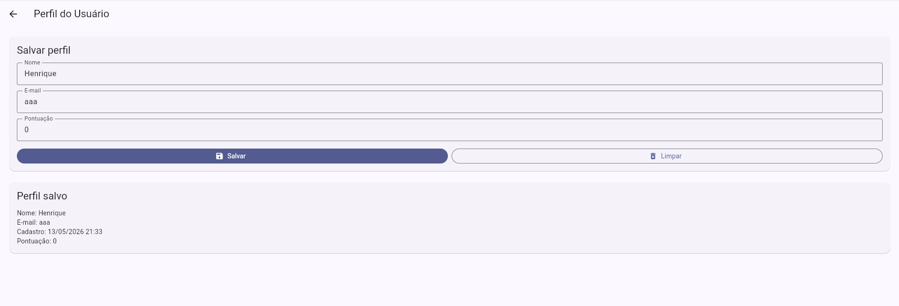
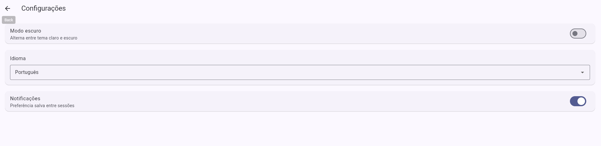
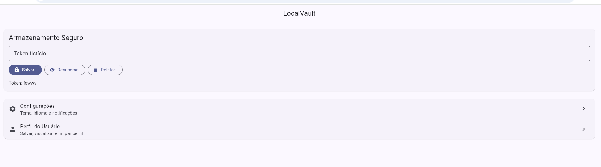

# LocalVault

**Aluno(a): Henrique**

LocalVault é um aplicativo Flutter criado para demonstrar persistência de dados local usando três tecnologias diferentes:

- **SharedPreferences** para configurações simples do app.
- **Hive** para armazenar o perfil do usuário em banco local NoSQL.
- **flutter_secure_storage** para armazenar um token fictício de autenticação com mais segurança.

O app também inclui uma implementação bônus de **migração de dados**, registrando a versão atual dos dados salvos localmente.

## Funcionalidades

### 1. Configurações — SharedPreferences

A tela de configurações permite:

- Ativar ou desativar modo escuro.
- Escolher idioma: Português ou Inglês.
- Ativar ou desativar notificações.

Essas preferências são carregadas automaticamente quando o app é aberto novamente.

### 2. Perfil do Usuário — Hive

A tela de perfil permite salvar e exibir um `UserProfile` com os campos:

- Nome
- E-mail
- Data de cadastro
- Pontuação

Também existe um botão para limpar os dados do perfil, representando o **direito ao esquecimento**, previsto pela LGPD.

### 3. Token Seguro — flutter_secure_storage

Na tela inicial, o app permite:

- Salvar um token fictício.
- Recuperar e exibir o token salvo.
- Deletar o token.

## Por que foi escolhido SharedPreferences para configurações?

O SharedPreferences é adequado para armazenar dados simples em formato chave-valor, como preferências do usuário. Como modo escuro, idioma e notificações são informações pequenas e simples, essa tecnologia é suficiente e prática.

## Por que foi escolhido Hive para o perfil do usuário?

O Hive foi escolhido porque permite armazenar objetos Dart localmente com bom desempenho. Como o perfil do usuário possui vários campos, o Hive oferece uma estrutura melhor do que SharedPreferences, além de funcionar bem offline.

## Por que foi escolhido flutter_secure_storage para o token?

O token fictício representa uma informação sensível. Por isso, foi usado flutter_secure_storage, que utiliza mecanismos seguros do Android e iOS para armazenar dados com maior proteção do que armazenamento comum.

## Migração de dados

O projeto inclui `MigrationService`, que verifica a versão atual dos dados salvos no SharedPreferences. Caso o app esteja em uma versão antiga, ele migra as chaves antigas para o novo formato e registra a versão `2`.

## LGPD — Reflexão

Se este app fosse publicado na Play Store, ele estaria coletando e armazenando localmente:

- Preferências do usuário, como tema, idioma e notificações.
- Dados de perfil, como nome, e-mail, data de cadastro e pontuação.
- Um token fictício de autenticação.

Para garantir transparência, o app deveria exibir uma política de privacidade informando quais dados são armazenados, por qual motivo e onde ficam salvos. Também deveria permitir que o usuário exclua seus dados facilmente. Neste projeto, isso é representado pelo botão de limpar perfil e pelo botão de deletar token.

## Como rodar o projeto

1. Clone o repositório:

```bash
git clone https://github.com/seu-usuario/localvault.git
```

2. Entre na pasta do projeto:

```bash
cd localvault
```

3. Instale as dependências:

```bash
flutter pub get
```

4. Gere o adapter do Hive, se quiser recriar o arquivo gerado:

```bash
dart run build_runner build --delete-conflicting-outputs
```

5. Rode o app:

```bash
flutter run
```

## Print da tela funcionando

```markdown



```
